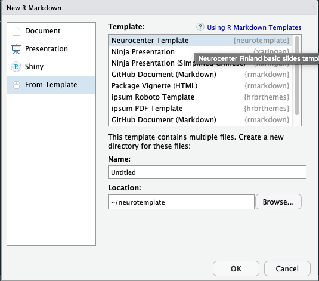

## Neurocenter Finland templates to create slideshows

Package includes color and font schemes for Neurocenter Finland presentations. This template packages needs a installation of the **xaringan** package from [Github](https://github.com/yihui/xaringan):

```r
devtools::install_github("yihui/xaringan")
```
Install template:

```r
devtools::install_github("janikmiet/neurocenterslides")
```
Restart your R instance. After this you can find a new template in your Rmarkdown files. Go to *File* -> *New File* -> *R markdown...* and select *From Template*


